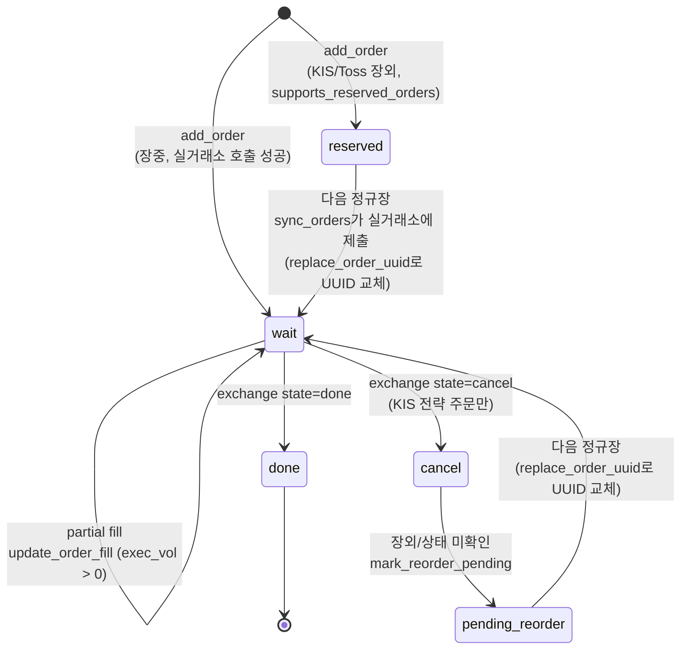

# order_manager.md

**파일**: `src/core/order_manager.py` (162줄)

## 역할
전체 사용자·거래소 활성 주문 영속화. 봇 제출 주문 단일 소스.

저장: **DB-우선 + 파일 폴백**. `core.db.is_db_available()` (`SUPABASE_URL` + `SUPABASE_SERVICE_KEY` 존재) 시 `orders` 테이블 로드, 변경사항 `_db_upsert(order)` / `_db_delete(uuid)` DB 반영. DB 미사용/실패 시 `data/orders.json` 폴백. 양방향 동기화 없음, 파일 비상용.

`replace_order_uuid(old, new)`: UUID PK. `_db_delete(old)` 후 `_db_upsert(new)` 처리 (in-place UPDATE 아님).

## 상태 기계



`market_closed`: `sync_orders` KIS 장외 임시 보류 상태 (다이어그램 미포함, `wait`/`reserved` 덧씌움 가능). 재주문 전 유지.

`reserved` ≠ `pending_reorder`. `pending_reorder`: **제출 후** 마감 취소된 주문. `reserved`: **미제출 장외** 주문 (가짜 uuid `reserved:<hex>` 등록). 둘 다 `sync_orders`(`src/main.py`)가 `supports_reserved_orders=True` 거래소(KIS/Toss) 다음 정규장 제출 처리. `add_order(..., status="reserved")`: `grid`/`rsitrade`/`sgridrsi`/`manual` 전략 호출부가 `getattr(ex, "supports_reserved_orders", False) and not ex.is_market_open(ticker)` 체크 후 직접 설정 — `order_manager` 무관 (호출부 책임).

## 주요 메서드

```python
manager.add_order(
    user_id, exchange, ticker, uuid, price, volume,
    side="bid",           # "bid" | "ask"
    strategy="manual",    # manual | grid | sgrid | rsitrade | rsitrade_sell | gridrsi | sgridrsi
    target_rsi=None,      # float, rsitrade/gridrsi/sgridrsi 레그 전용
    linked_to=None,       # rsitrade/gridrsi 매수 레그: 매도 목표 RSI(float). sgridrsi는 None
    status="wait"
)

manager.update_order_fill(uuid, filled_volume, status)  # 부분/전체 체결 업데이트
manager.update_order_status(uuid, status)               # 상태만 업데이트
manager.mark_reorder_pending(uuid, next_check_at)       # KIS 장외 처리
manager.replace_order_uuid(old_uuid, new_uuid)          # KIS 재주문 (전략 의도 유지)
manager.update_next_check_at(uuid, next_check_at)
manager.remove_order(uuid)
manager.get_user_orders(user_id, exchange=None)
manager.get_strategy_orders(user_id, strategy)
manager.clear_user_orders(user_id)  # 해당 유저의 모든 주문을 DB+메모리에서 삭제(거래소 취소는 호출부 책임), 삭제 건수 반환
```

`on_order_added` 콜백: `post_init` 설정. 새 주문 시 `_order_wake_event` 깨움 → 즉시 sync.

## 스키마 핵심 필드 (동기화 로직 관련)

| 필드 | 설명 |
|------|------|
| `filled_volume` | 체결량. exchange `executed_volume` 비교 후 부분체결 감지 |
| `linked_to` | rsitrade/gridrsi 매수 레그: 매도 RSI. 체결 시 `sync_orders` 매도가 계산. sgridrsi None |
| `reorder_of` | `replace_order_uuid` 이전 uuid 저장 (감사 체인) |
| `next_check_at` | Unix timestamp. sync 루프 건너뜀 시각 |

전체 스키마 `CLAUDE.md` 참조.

## 영속화 세부 사항
- DB-우선: `is_db_available()` 시 `orders` 테이블 사용. 쓰기 `_db_upsert`/`_db_delete`, `uuid` PK.
- 컬럼 매핑: `created_at` / `next_check_at` Unix timestamp (`DOUBLE PRECISION`) 저장 — 변환 없음.
- 파일 폴백: DB 미사용/실패 시 `data/orders.json` (인자 변경 가능), 쓰기 후 `chmod 0600` 적용.
- asyncio 단일 이벤트 루프 → 잠금 불필요.

## 참조
- KIS pending_reorder 상세 흐름: `docs/302_kis_market_policy.md`
- 유저 전체 리셋 (`/resetuser`, 거래소 취소 + `clear_user_orders` + `trade_log.clear_user_trades`): `docs/205_main_handlers.md`
