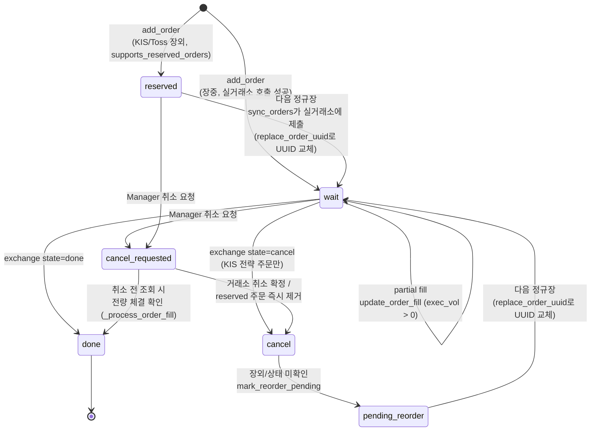

# order_manager.md

**파일**: `src/core/order_manager.py` (162줄)

## 역할
전체 사용자·거래소 활성 주문 영속화. 봇 제출 주문 단일 소스.

저장: **DB-우선 + 파일 폴백**. `core.db.is_db_available()` (`SUPABASE_URL` + `SUPABASE_SERVICE_KEY` 존재) 시 `orders` 테이블 로드, 변경사항 `_db_upsert(order)` / `_db_delete(uuid)` DB 반영. DB 미사용/실패 시 `data/orders.json` 폴백. 양방향 동기화 없음, 파일 비상용.

`replace_order_uuid(old, new)`: UUID PK. `_db_delete(old)` 후 `_db_upsert(new)` 처리 (in-place UPDATE 아님).

## 상태 기계


```mermaid
stateDiagram-v2
    [*] --> wait: add_order<br/>(장중, 실거래소 호출 성공)
    [*] --> reserved: add_order<br/>(KIS/Toss 장외, supports_reserved_orders)

    reserved --> wait: 다음 정규장<br/>sync_orders가 실거래소에 제출<br/>(replace_order_uuid로 UUID 교체)

    wait --> wait: partial fill<br/>update_order_fill (exec_vol > 0)
    wait --> done: exchange state=done
    wait --> cancel: exchange state=cancel<br/>(KIS 전략 주문만)

    wait --> cancel_requested: Manager 취소 요청
    reserved --> cancel_requested: Manager 취소 요청
    cancel_requested --> cancel: 거래소 취소 확정 /<br/>reserved 주문 즉시 제거
    cancel_requested --> done: 취소 전 조회 시<br/>전량 체결 확인 (_process_order_fill)

    cancel --> pending_reorder: 장외/상태 미확인<br/>mark_reorder_pending
    pending_reorder --> wait: 다음 정규장<br/>(replace_order_uuid로 UUID 교체)

    done --> [*]
```

- `market_closed`: `sync_orders` KIS 장외 임시 보류 상태 (다이어그램 미포함, `wait`/`reserved` 덧씌움 가능). 재주문 전 유지.
- `reserved` ≠ `pending_reorder`. `pending_reorder`: **제출 후** 마감 취소된 주문. `reserved`: **미제출 장외** 주문 (가짜 uuid `reserved:<hex>` 등록). 둘 다 `sync_orders`(`src/core/order_sync.py`)가 `supports_reserved_orders=True` 거래소(KIS/Toss) 다음 정규장 제출 처리. `add_order(..., status="reserved")`: `grid`/`rsitrade`/`sgridrsi`/`manual` 전략 호출부가 `getattr(ex, "supports_reserved_orders", False) and not ex.is_market_open(ticker)` 체크 후 직접 설정 — `order_manager` 무관 (호출부 책임).
- `cancel_requested`: 웹 매니저/백엔드가 비동기로 취소를 요청한 상태.
  - 거래소 미제출(`reserved:`) 주문은 즉시 메모리/DB에서 제거.
  - 거래소 제출 주문은 취소 전 실거래소 체결 여부를 먼저 확인하여 이미 완료(`done`)된 경우 체결 처리(`_process_order_fill`), 부분 체결(`executed_volume > 0`)이 있을 경우 취소 성공 후 `trade_logs`에 부분 체결분을 기록하여 정산 무결성을 유지.
  - 거래소 취소 요청 실패 시 `cancel_requested` 상태를 유지하여 다음 sync 주기에서 재시도.

## 주요 메서드

```python
manager.add_order(
    user_id, exchange, ticker, uuid, price, volume,
    side="bid",           # "bid" | "ask"
    strategy="manual",    # manual | grid | sgrid | rsitrade | rsitrade_sell | gridrsi | sgridrsi
    target_rsi=None,      # float, rsitrade/gridrsi/sgridrsi 레그 전용
    linked_to=None,       # rsitrade/gridrsi 매수 레그: 매도 목표 RSI(float). sgridrsi는 None
    template_id=None,     # int | None, 전략 템플릿 연결 (매도 주문 시 매수 템플릿 ID 승계)
    group_no=None,        # int | None, TOP N 및 배치 전략의 회차/그룹 번호
    status="wait",
    order_type=None       # "limit" | "market" | None
)

manager.update_order_fill(uuid, filled_volume, status)  # 부분/전체 체결 업데이트
manager.update_order_status(uuid, status)               # 상태만 업데이트
manager.mark_reorder_pending(uuid, next_check_at)       # KIS 장외 처리
manager.replace_order_uuid(old_uuid, new_uuid)          # KIS 재주문 (전략 의도 유지)
manager.update_next_check_at(uuid, next_check_at)
manager.remove_order(uuid)
manager.get_user_orders(user_id, exchange=None)
manager.get_strategy_orders(user_id, strategy)
manager.clear_user_orders(user_id)  # 해당 유저의 모든 주문을 DB+메모리에서 삭제(거래소 취소는 호출부 책임), 삭제 건수 반환
```

`on_order_added` 콜백: `post_init` 설정. 새 주문 시 `_order_wake_event` 깨움 → 즉시 sync. 매니저에서 배치 주문(DCA / TOP N 등) 등록 또는 청산 주문 발행 시에도 웹훅(`POST /api/internal/orders/wake`)을 통해 봇의 `_order_wake_event`를 즉시 세팅하여 슬립 지연 없이 동기화를 수행합니다.

## 스키마 핵심 필드 (동기화 로직 관련)

| 필드 | 설명 |
|------|------|
| `filled_volume` | 체결량. exchange `executed_volume` 비교 후 부분체결 감지 |
| `linked_to` | rsitrade/gridrsi 매수 레그: 매도 RSI. 체결 시 `sync_orders` 매도가 계산. sgridrsi None |
| `reorder_of` | `replace_order_uuid` 이전 uuid 저장 (감사 체인) |
| `next_check_at` | Unix timestamp. sync 루프 건너뜀 시각 |
| `template_id` | 전략 템플릿 ID (RSI 연결 매도 주문, 부분 체결, 예산 감사 원장 연동 시 승계) |
| `group_no` | TOP N 및 배치 전략의 회차/그룹 번호 (체결 내역 및 예산 감사 원장 연동) |
| `order_type` | 주문 유형 (`"limit"` \| `"market"` \| `None`). DCA 지정가 취소 환원(`ORDER_CANCEL_REFUND`) 및 시장가 차액 정산(`BUY_ORDER_ADJUST`) 분기 기준 |

전체 스키마 `CLAUDE.md` 참조.

## 영속화 세부 사항
- DB-우선: `is_db_available()` 시 `orders` 테이블 사용. 쓰기 `_db_upsert`/`_db_delete`, `uuid` PK. DB 리로드/upsert/delete 실패 시 `operational_events`에 오류 기록 후 파일 폴백 및 `db_sync` 재시도 큐 적재.
- 컬럼 매핑: `created_at` / `next_check_at` Unix timestamp (`DOUBLE PRECISION`) 저장 — 변환 없음.
- 파일 폴백: DB 미사용/실패 시 `data/orders.json` (인자 변경 가능), 쓰기 후 `chmod 0600` 적용.
- asyncio 단일 이벤트 루프 → 잠금 불필요.

## 웹 매니저 주문 조회 및 상태 정책

매니저 백엔드(`manager/backend/routers/orders.py`) 및 대시보드(`dashboard.py`)의 상태 정책:
- **오픈 주문 기본 정의 (`_OPEN_STATUSES`)**:
  - `_OPEN_STATUSES = ("wait", "partial", "pending_reorder", "reserved")`
  - 취소 API(`POST /api/orders/cancel`, `POST /api/orders/cancel-all`)는 대상 주문을 `_OPEN_STATUSES`로 한정하여 중복 취소 요청을 방지합니다.
- **오픈 주문 목록 조회 및 대시보드 집계 (`_LISTED_OPEN_STATUSES`)**:
  - `_LISTED_OPEN_STATUSES = _OPEN_STATUSES + ("cancel_requested",)`
  - 열린 주문 목록(`?status=open`) 및 대시보드 활성 주문 수(`orders_open`)에는 봇이 거래소 취소를 확정하기 전까지 `cancel_requested` 상태를 포함해 화면에 노출합니다.
- **상태 라벨 및 UI 표시**:
  - `_STATUS_LABELS`: `"cancel_requested": "취소중"` (프론트엔드 Badge 컴포넌트: `cancel_requested` 로즈 배지 매핑).
- **전략 정산(Reconciliation)과의 연동**:
  - `progression_manager.py`는 `cancel_requested` 상태인 주문을 즉시 환불하지 않고 `deferred_pending_buys`로 보류하여 다음 배치의 `pending_buy_orders`로 이월합니다. 봇이 거래소 취소를 확정(또는 체결 완료)한 이후 주기에서 안전하게 정산 및 환불을 진행합니다.

## TOP N 발주 가격 정책 및 단가 변동 정산 (`order_price_mode`)

장외 배치 생성 시점의 가격(전일 종가 등)은 장 개시 시점에 낡은 가격이 되므로, `sync_orders`가 `reserved` 주문을 실제 거래소에 제출할 때 `compute_top_n_order_plan()`을 통해 실시간 현재가 기준으로 주문 유형과 가격을 재산정합니다:
- **`limit_current` (기본값)**: 현재가 기준 호가 틱(`adjust_krx_price_to_tick`)으로 지정가 제출.
- **`limit_aggressive`**: 체결 확률을 높이기 위해 현재가 대비 KRX 호가 2틱 유리하게(매수 +2틱, 매도 -2틱) 계산하여 지정가 제출 (`_shift_krx_ticks` 호가 단위 경계 재계산).
- **`market`**: 시장가 주문으로 제출.
- **단가 변동 정산 (`BUY_ORDER_ADJUST`)**: 실제 발주된 가격이 당초 예약된 가격과 달라져 총 소요 금액에 차이가 발생하면, `record_budget_adjust`를 통해 차액(양수: 추가 차감, 음수: 잔여 환원)을 `budget_ledger`에 불변 원장으로 즉시 기록하고 `carryover_budget`에 반영합니다.

## 부분 체결 취소 정산 및 미체결 잔여 예산 환원

- 거래소에서 주문이 취소되거나 사용자가 매니저에서 주문 취소를 실행할 때, 해당 주문의 체결량(`filled_volume` 또는 거래소 `executed_volume` > 0)이 존재하면:
  1. 기체결 수량에 대해서는 `append_trade()`를 호출하여 `trade_logs`에 체결 내역을 정상적으로 기록·보존합니다.
  2. 잔여 미체결 수량(`max(0, volume - filled_volume)`)에 대해서만 `_refund_unfilled_budget(ord, exec_vol)`을 호출하여 `ORDER_CANCEL_REFUND`로 원장에 환원합니다.
  3. 이를 통해 부분 체결 후 주문 취소 시 전액 환불이나 체결 누락으로 인해 예산과 보유 자산이 왜곡되는 문제를 원천 차단합니다.
  4. 빗썸 등 가상자산 거래소의 취소/상태 조회 시 에러 응답(`_is_error_response`) 및 부분 체결 상태(`_normalize_order_state`)도 정규화하여 방어합니다.

## 체결 로그(`trade_logs`) 영속화 안정화 및 병합

- **DB 삽입 실패 방어**: `append_trade()` 호출 시 DB에 `template_id`, `group_no` 컬럼이 없는 구버전 스키마이거나 일시적 오류가 발생하면, 해당 필드를 제거한 fallback 데이터로 2차 시도하고, 여전히 실패할 경우 `db_sync` 비동기 큐(`enqueue_task`)에 적재하여 작업 손실(Silent Drop)을 방지합니다.
- **중복 제거 조회 병합 (`read_trades`)**: 컨테이너 재시작 등으로 로컬 JSON 파일에 최신 체결 내역만 있더라도, Supabase DB의 과거 체결 내역을 함께 조회하여 주문 UUID 또는 복합키(`user_id`, `exchange`, `ticker`, `side`, `ts`, `volume`) 기준으로 중복 없이 병합(dedup) 정렬하여 반환합니다.

## 참조
- KIS pending_reorder 상세 흐름: `docs/302_kis_market_policy.md`
- 메인 핸들러 및 sync_orders 상세 흐름: `docs/205_main_handlers.md`
- 유저 전체 리셋 (`/resetuser`, 거래소 취소 + `clear_user_orders` + `trade_log.clear_user_trades`): `docs/205_main_handlers.md`
