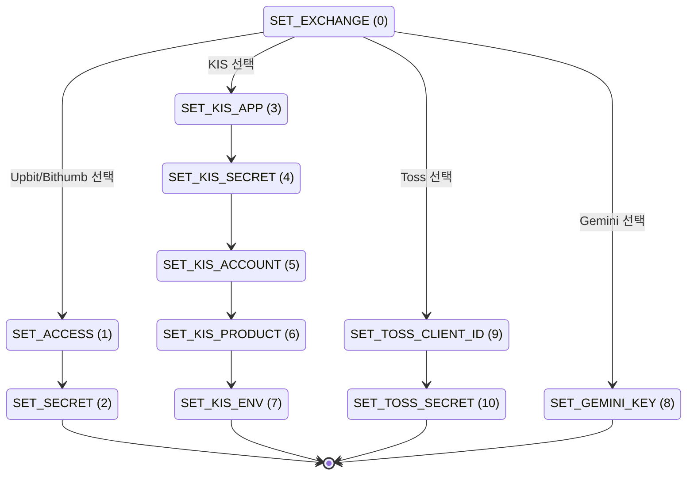

# 205_main_handlers.md

**파일**: `src/main.py` (메인 봇 제어 흐름, 핸들러 분리 구조)

## 모듈 전역 객체

```python
user_manager     = UserManager()
exchange_adapter = ExchangeAdapter(user_manager)
order_manager    = OrderManager()
signal_engine    = SignalEngine(user_manager, exchange_adapter)
metrics          # core.metrics — 인메모리 운영 지표 (주문 성공률, 레이턴시, 루프 타임스탬프)
_order_wake_event: asyncio.Event    # 새 주문 발생 시 sync 루프 즉시 기상
_pending_nl_intents: dict           # token → {user_id, intent} (Gemini 확인 대기)
KST = timezone(timedelta(hours=9))
```

- **데이터 영속화**: `core.db` (Supabase REST 클라이언트) 우선 사용 + `data/*.json` 로컬 파일 폴백.
- `user_manager`/`order_manager`는 DB 우선, `trade_log`/`operational_events`는 DB+파일 이중 쓰기.

## 커맨드 맵

| 커맨드 | 핸들러 | 비고 |
| :--- | :--- | :--- |
| `/start` | `start_command` | 유저 등록, 관리자 승인 요청 |
| `/help`, `/commands` | `help_command` | 전체 커맨드 메뉴 출력 |
| `/info` | `info_command` | `build_info.py` 버전/빌드 정보 조회 |
| `/config`, `/cfg` | `config_command` | 다단계 키 설정 (ConversationHandler) |
| `/whoami`, `/me` | `whoami_command` | ID, 권한, 활성 상태 확인 |
| `/asset` | `asset_command` | 전체 잔고 조회. 상위 5개 표시, 인라인 접기/펼치기 지원 |
| `/price`, `/p` | `price_command` | 실시간 시세 조회 |
| `/indicators`, `/ind` | `indicators_command` | RSI/MACD/볼린저밴드/스토캐스틱 통합 조회 |
| `/history` | `history_command` | 최근 체결 내역 (5건씩 페이지네이션) |
| `/report` | `report_command` | 기간별 수익률 리포트 (10건씩 페이지네이션) |
| `/orders` | `orders_command` | 추적 중인 미체결 주문 목록 (배치 번호별 요약/펼치기) |
| `/status` | `status_command` | 전략 대시보드 (그룹당 3건 요약/펼치기) |
| `/buy` | `buy_command` | 지정가 매수 (서버 토큰 10분 만료 검증) |
| `/sell` | `sell_command` | 지정가 매도 (서버 토큰 10분 만료 검증) |
| `/grid` | `grid_command` | 지정 범위 분할 매수 전략 실행 |
| `/sgrid` | `sgrid_command` | 보유 수량 분할 매도 전략 실행 |
| `/rsitrade`, `/gridrsi`| `rsitrade_command` | RSI 역산 분할 매수 전략 (linked_to 자동 익절 매도 생성) |
| `/sgridrsi` | `sgridrsi_command` | RSI 목표가 분할 매도 전략 |
| `/cancel` | `cancel_command` | 종목 전체 주문 취소 |
| `/cancelno` | `cancelno_command` | 배치 번호(#N) 기준 주문 묶음 취소 |
| `/watch` | `watch_command` | RSI 감시 대상 종목 추가 |
| `/unwatch` | `unwatch_command` | RSI 감시 대상 종목 제거 |
| `(일반 텍스트)` | `natural_language_command` | Gemini 자연어 분석 처리 |

*(※ `/me`, `/p`, `/ind`, `/cfg`, `/rsigrid` 등 단축/비밀 alias는 텔레그램 공식 메뉴에 미노출, CommandHandler로 작동)*

## ConversationHandler 상태 (/config)


- API 키 포함 사용자 입력 메시지는 캡처 즉시 삭제 처리 (`delete_message`).

## 인증 미들웨어

- `@check_auth` 데코레이터 적용:
  1. `user_manager.get_user(chat_id)` 조회.
  2. 미등록 유저 시 안내 메시지 반환 후 중단.
  3. `is_active=False` (승인 대기) 상태 시 승인 대기 메시지 반환 후 중단.
  4. 정상 유저인 경우 핸들러 호출 (`user` 딕셔너리를 세 번째 인자로 전달).

## 백그라운드 루프

### order_sync_loop
- `sync_orders(application)` 주기적 실행.
- 간격: 주문 존재 시 `poll_active_interval` (60초) / 주문 무 시 `poll_no_order_interval` (300초).
- 간격 결정: `system_config` 테이블 주기 우선 사용, DB 미사용 시 관리자 preferences 기준 폴백.
- `_order_wake_event` 발생 시 대기 루프 즉시 깨어남.
- 성공 시 `metrics.record_poll_ok()` 타임스탬프 기록.

### signal_analysis_loop
- `signal_engine.analyze_watchlist(application)` 주기적 실행.
- 간격: `signal_analysis_interval` (300초). `system_config` 테이블 값 우선 사용.

### sync_orders 핵심 처리 흐름
1. **KIS 장외 세션**: `market_closed` / `pending_reorder` 판정 시 `next_check_at` 대기 시각 설정.
2. **KIS 재주문**: `pending_reorder` 상태 잔량에 대해 재주문 시도 (`replace_order_uuid`).
3. **일반 주문**: `get_order_status` 실시간 조회, 체결 발생 시 `filled_volume` 갱신.
4. **연동 주문**: rsitrade/gridrsi 매수 체결 완료 및 `linked_to` 존재 시 목표 익절가 계산 후 즉시 매도 주문 전송 (`rsitrade_sell`).
5. **종료 판정**: `done`/`cancel` 도달 시 추적 리스트에서 제외 (KIS 전략 등은 제외).

## KIS 시간 헬퍼
- `is_kis_regular_session(now=None)` -> bool (평일 09:00–15:35 KST 판정).
- `next_kis_regular_session(now=None)` -> datetime (다음 정규장 시작일시).
- `kis_next_check_timestamp(now=None)` -> float (다음 체크 Unix timestamp).

---

## 🔗 연관 명세 문서
- **자연어 처리 및 인텐트 흐름**: [205a_natural_language.md](file:///E:/apps/supabot/docs/205a_natural_language.md)
- **보안 설정 및 일회용 토큰, 안전장치**: [205b_security_logging.md](file:///E:/apps/supabot/docs/205b_security_logging.md)
- **유틸리티 파서 및 포맷터 함수**: [205c_utility_parsers.md](file:///E:/apps/supabot/docs/205c_utility_parsers.md)
