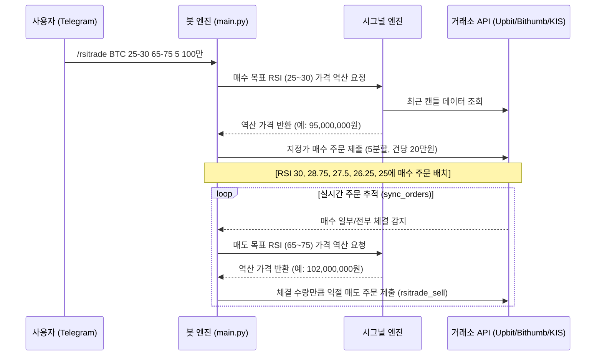

# rsi_algorithm.md — RSI 역산 수식 및 자동매매 전략 상세 명세

수파봇(supabot) 핵심 트레이딩 전략(RSI 순환 매매, 거미줄 매수/매도) 수학적 원리, 탐색 알고리즘, 라이프사이클, 예외 처리 명세.

---

## 1. RSI 가격 역산 알고리즘

### 표준 RSI 공식 (순방향)
RSI: 일정 기간(14캔들) 가격 상승/하락 상대 강도 백분율.
$$RSI = 100 - \frac{100}{1 + RS}$$
$$RS = \frac{\text{AvgGain (평균 상승폭)}}{\text{AvgLoss (평균 하락폭)}}$$

순방향 RSI 계산: 파이썬 `ta` 라이브러리 `ta.momentum.RSIIndicator` 사용.

### 역산(Reverse Calculation) 방식
일반 지표 매매는 "RSI N 이하 시 매수". 급등락 시 미체결/슬리피지 발생.
수파봇: **"목표 RSI(예: 30) 만드는 가격은?"** 역산하여 **지정가 주문** 사전 배치.

1. **가상 캔들 대입 기법**
   - 과거 종가 배열(캔들 `period + 50`개) 끝에 `가상의 다음 종가(next_close)` 추가.
   - `close_series + [next_close]` 데이터셋 `RSIIndicator` 재실행.
   
2. **이분 탐색 (Binary Search)을 통한 가격 추적**
   - **매수(Bid)**: 가상 가격 현재가 아래로 낮추며 목표 RSI 이하 경계가 탐색.
   - **매도(Ask)**: 가상 가격 현재가 위로 높이며 목표 RSI 이상 경계가 탐색.
   - 봇 RSI 표시값, 미리보기 주문가 일치 보장.

3. **수수료 및 슬리피지 버퍼 (0.1%)**
   RSI 트리거 도달 즉시 체결 위해 역산 목표가 버퍼 적용.
   - **매수 가격**: $\text{target\_price} \times 0.999$ (RSI 트리거가 대비 0.1% 저가 매수)
   - **매도 가격**: $\text{target\_price} \times 1.001$ (RSI 트리거가 대비 0.1% 고가 매도)
   
4. **호가 틱(Tick) 보정**
   최종 가격 거래소/가격대별 호가 단위(Tick Size) 내림(floor) 보정.

---

## 2. RSI 순환 매매 전략 (`/rsitrade`)

과매도 매집, 과매수 분할 익절 순환 매매 흐름.

### 핵심 상세 로직

1. **분할 매수 진입**
   - 매수 RSI 구간(예: `25-30`), 분할 횟수(예: `5`) 기준 등간격 목표 RSI 분할 (예: 30, 28.75, 27.5, 26.25, 25).
   - RSI별 가격 역산, 총 예산/분할 횟수 금액 매수 주문 제출.

2. **체결 대응 및 익절 매도 (`rsitrade_sell`)**
   - 백그라운드 폴링 스레드 `sync_orders` 주문 체결 확인.
   - 매수 체결 시 **체결 수량만큼 즉시 익절 매도 주문 생성**.
   - 매도가: 설정 매도 RSI 구간(예: `65-75`) 하한선(RSI 65) 실시간 역산 지정가 제출.

3. **손절(Stop-Loss) 및 트레이링 스톱(Trailing Stop)**
   - **손절가 계산**: 매수 체결 후 매도 대기(`rsitrade_sell`) 시 `stop_loss_pct` 존재하면 매수가 기준 손절가 DB 기록.
     $$\text{stop\_price} = \text{buy\_price} \times \left(1 - \frac{\text{stop\_loss\_pct}}{100}\right)$$
   - **손절 실행**: 현재가 `stop_price` 미만 하락 시 익절 매도 취소 후 긴급 손절가(현재가 $\times 0.999$) 주문 제출.
   - **트레이링 스톱**: `trailing_stop_pct` 설정 시 고점 갱신 마다 `stop_price` 상향.

---

## 3. 거미줄 분할 매매 전략 (`/grid`, `/sgrid`)

가격 범위 내 거미줄망 분할 주문 배치 그리드 매매.

### 거미줄 매수 (`/grid`)
- **개념**: 매집용 가격 밴드(`시작가` ~ `종료가`)에 예산 균등 분할 매수 배치.
- **주문당 수량 계산**: 
  $$\text{volume} = \frac{\text{총 예산} / \text{주문 개수}}{\text{해당 그리드 가격}}$$
- **제약 사항**:
  - KIS: 소수점 불가하여 `int(volume)` 내림. 주문 수량 `0주` 소액 주문 사전 차단.

### 거미줄 매도 (`/sgrid`)
- **개념**: 보유 자산 분할 익절/탈출용 가격 범위 수량 분할 매도 배치.
- **주문당 수량 계산**: 
  $$\text{volume} = \frac{\text{보유 총 수량}}{\text{주문 개수}}$$
- **제약 사항**:
  - KIS: 총 수량 < 주문 개수로 1주 미만 조각 시 제출 단계 취소.

---

## 4. 거래소별 전략 처리 특이사항

### 한국투자증권 (KIS) 국내주식
1. **정규장 거래 제한**:
   - 정규장 평일 09:00 - 15:35 운영, 장외 신규 주문 불가.
   - 장외/주말 `/grid` / `/sgrid` (`/rsitrade`, `/sgridrsi`, `/buy`, `/sell`) 요청 시 `reserved` 상태 등록 후 다음 정규장(09:00) 자동 제출 (`docs/202_order_manager.md`).
2. **주문 만료 및 재주문 복구 (`pending_reorder`)**:
   - 지정가 주문 정규장 마감(15:35) 당일 만료 취소.
   - KIS 취소 주문 감지 시 `pending_reorder` 상태 이월.
   - 다음 영업일 09:00 **"원래 목표 수량 - 체결 수량"** 잔량 자동 재주문.
   - 재주문 완료 시 신규 주문 ID(UUID) 발급, 감사 체인 `reorder_of` 연결 추적.

### 코인 거래소 (Upbit / Bithumb)
- 24시간 연중무휴, 장외/만료 재주문 없음. 체결 또는 취소 전까지 영구 추적.
