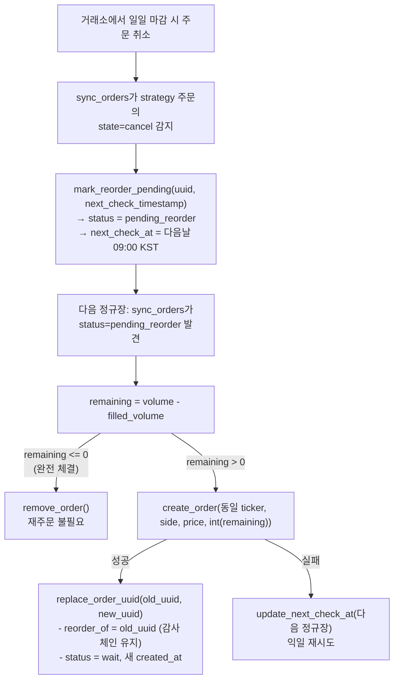

# kis_market_policy.md — KIS 정규장 정책 및 재주문 로직

## 왜 KIS는 특수 처리가 필요한가

KIS(한국투자증권) KRX 정규장만 주문 처리. 지정가 주문 당일 마감 소멸. 봇 전략 주문 매일 아침 재제출 필요.

## 정규장 판별 함수

```python
def is_kis_regular_session(now=None) -> bool:
    # 평일(월=0 ~ 금=4)만 유효
    # 정규장: 09:00:00 – 15:35:00 KST (양 끝 포함)
    now = _as_kst_now(now)
    if now.weekday() >= 5:
        return False
    return dt_time(9, 0) <= now.time() <= dt_time(15, 35)
```

`_as_kst_now(now)` — KST aware datetime 반환. naive datetime KST 가정 (테스트용).

## 다음 정규장 계산

```python
def next_kis_regular_session(now=None) -> datetime:
    # 오늘 평일이고 09:00 이전 → 오늘 09:00
    # 그 외 → 다음 평일 09:00
    # 토·일 건너뜀
```

`kis_next_check_timestamp()` — 위 wrapping, Unix float 반환.

## 장외 시간 주문 처리 흐름

`sync_orders` KIS 주문 만남 & `exchange_adapter.get_exchange(exchange).is_market_open()` False 시 (`KisExchange.is_market_open()` 내부 `is_kis_regular_session()` 호출):
1. `update_next_check_at(uuid, kis_next_check_timestamp())` 설정
2. sync 루프 `next_check_at` 이전 해당 주문 건너뜀

## 신규 주문 발행 시점에 장외인 경우 — reserved 배치

위 흐름 **이미 거래소 제출 주문** 장외 진입 케이스. 반면 `/grid`, `/rsitrade`, `/sgridrsi`, `/buy`, `/sell` 장외 시간 실행 시 KIS/Toss 장외 신규 주문 제출 불가. 호출부(`src/core/order_execution.py`, `src/handlers/manual_order_handlers.py`) 실거래소 API 미호출, 가짜 uuid(`reserved:<hex>`) `order_manager.add_order(..., status="reserved")` 등록:

```python
is_reserved = getattr(ex, "supports_reserved_orders", False) and not ex.is_market_open(ticker)
```

분기 누락 시 (`execute_rsitrade_orders`/`execute_sgridrsi_orders`/수동 주문 과거 버그) 장외 호출 실거래소 API 직접 전달 실패, 추적/manager UI 주문 유실 — grid 동일 분기 유지 필수.

`reserved` 주문 다음 정규장 `sync_orders`(`src/main.py:307`) `pending_reorder` 동일 경로 실제 `create_order()` 제출 후 `replace_order_uuid` 진짜 uuid 교체. 상세 상태 기계 `docs/202_order_manager.md` 참조.

`supports_reserved_orders=True`는 `RegularSessionMixin`(`src/core/exchanges/regular_session.py`) 상속 거래소(KIS/Toss) 공통 capability. Toss 동일 적용.

## 전략 주문 재주문 흐름



## 수동 주문 vs 전략 주문

| 구분 | 재주문 여부 | 취소/만료 시 동작 |
|------|------------|------------------|
| `strategy="manual"` | X | 추적 제거 + 알림 |
| `strategy="grid"/"sgrid"/"rsitrade"` | O | `pending_reorder` 전환 |

## 부분 체결 처리

`filled_volume` 은 `replace_order_uuid` 시 보존. 재주문 수량 `volume - filled_volume` 잔량. KIS 정수 단위 `int(remaining)` 사용, 0 시 재주문 생략.

## 테스트 커버리지

`tests/test_config_and_market_policy.py` 의 `test_kis_market_time_gate`:
- 정규장 내부 → `True`
- 마감 후(16:00) → `False`
- 토요일 → `False`
- `next_kis_regular_session(마감후)` → 다음 월요일 09:00
