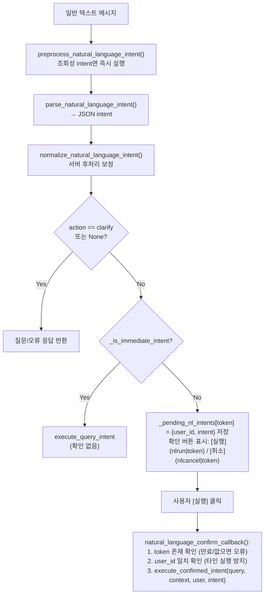

# gemini_intent.md — Gemini 자연어 Intent 처리

## 개요

`llm_enabled=True` 시 텍스트 메시지 룰 기반 전처리. 미처리 문장만 Google Gemini API로 JSON intent 변환. "비트코인 시세 알려줘" 등 자연어 입력 가능.

## 사전 조건

- `users.json → llm.gemini_api_key` 설정 필요
- `llm_enabled=True` 필요
- `validate_config_update`: `llm_enabled=True` + 빈 API 키 조합 → `ValueError`

## 룰 기반 전처리

Gemini 호출 전 `preprocess_natural_language_intent(text, user)` 실행.

조회성 action만 허용.

| action | 예시 표현 | 처리 |
|--------|-----------|------|
| `status` | `주문대기중인것은?`, `예약 주문 보여줘`, `전략 상태 알려줘` | 전략 대시보드 즉시 조회 |
| `orders` | `미체결 주문 뭐 있어?`, `오픈오더`, `거래소에 걸린 주문` | 미체결 주문 즉시 조회 |
| `asset` | `잔고 보여줘`, `보유 자산`, `빗썸 잔고` | 자산 조회 |
| `price` | `BTC 시세`, `비트 얼마야`, `삼성전자 가격` | 종목 추출 시 시세 조회 |
| `history` | `최근 체결`, `거래 내역`, `BTC 거래내역` | 최근 체결 조회 |
| `config_view` | `현재 설정 보여줘`, `API 등록 상태` | 설정 조회 |
| `help` | `사용법`, `명령어 알려줘`, `도움말` | 도움말 조회 |

`취소`, `중지`, `매수`, `매도`, `사줘`, `설정해`, `변경`, `켜줘`, `꺼줘` 등 변경성 표현은 전처리 제외. Gemini 및 확인 버튼 흐름으로 전달.

`normalize_natural_language_intent()`로 Gemini intent 후처리. RSI+분할+매도 힌트(`매도`, `팔아`, `팔다` 등) 감지 시 action `sgridrsi`, RSI 구간 `sell_rsi_range` 지정. 매도 힌트 없는 RSI+분할은 `rsitrade` + `buy_rsi_range` 처리.

문장 내 `dca`, `디씨에이`, `물타기` 포함(또는 Gemini `dca_mode: true` 반환) 시 `rsitrade` intent `dca_mode` = `true`. `sgridrsi`(매도) 미적용.

전처리 완료 문장은 Gemini 미호출 및 노로그.
action hit 카운터만 `data/nl_preprocess_hits.json` 저장 (원문/종목/거래소 미저장).
`비트 봐줘` 등 종목은 있으나 의도 불명확 시 시세/자산/전략상태 되물음.

## Gemini 프롬프트 구조

`_build_llm_prompt(user_text, user)` — zero-shot JSON 추출:

```
You parse Korean Telegram trading bot messages into one JSON object only.
Do not execute anything. Use null for unknown fields.
Supported actions: asset, price, orders, status, config_view, history,
  buy, sell, grid, sgrid, rsitrade, gridrsi, sgridrsi, watch, unwatch, config_set, cancel, help, clarify.
Pending/reserved/tracked strategy orders => status. Real open/unfilled exchange orders => orders.
Schema: { "action": str, "exchange": str|null, "ticker": str|null,
          "price": num|null, "volume": num|null, "amount_krw": num|null,
          "start_price": num|null, "end_price": num|null, "count": int|null,
          "buy_rsi_range": str|null, "sell_rsi_range": str|null, "dca_mode": bool|null,
          "config_key": str|null, "config_value": str|null, "question": str|null }
Exchange: upbit | bithumb | kis | null. Default: {user's default_exchange}.
User text: {text}
```

temperature=0.1, `response_mime_type="application/json"`.

## Intent 스키마

```python
{
    "action":         str,         # 지원 action 목록 또는 null
    "exchange":       str|None,    # "upbit" | "bithumb" | "kis" | null
    "ticker":         str|None,    # "BTC", "005930" 등
    "price":          float|None,
    "volume":         float|None,
    "amount_krw":     float|None,
    "start_price":    float|None,
    "end_price":      float|None,
    "count":          int|None,
    "buy_rsi_range":  str|None,    # "25-30" — rsitrade/gridrsi 매수 RSI 구간
    "sell_rsi_range": str|None,    # "65-75" — sgridrsi 매도 RSI 구간 (rsitrade에서는 자동매도 목표)
    "dca_mode":       bool|None,   # true면 rsitrade 예산을 get_dca_weights로 가중 분배
                                    # (구조화 /rsitrade -dca와 동일, sgridrsi 미적용)
    "config_key":     str|None,
    "config_value":   str|None,
    "question":       str|None,    # action=="clarify" 시 Gemini의 질문
}
```

## 읽기 vs 쓰기 구분

`_is_immediate_intent(action)`으로 즉시 실행 판별:

```python
IMMEDIATE = {"asset", "price", "orders", "status", "config_view", "history", "help"}
```

| 구분 | 액션 목록 | 처리 |
|------|-----------|------|
| **읽기 (즉시)** | asset, price, orders, status, config_view, history, help | `execute_query_intent` |
| **쓰기 (확인)** | buy, sell, grid, sgrid, rsitrade, gridrsi, sgridrsi, watch, unwatch, config_set, cancel | 확인 버튼 표시 후 실행 |

## 확인 플로우



`execute_confirmed_intent`는 커맨드 핸들러와 동일 내부 함수 호출 (어댑터, 검증 동일 적용).

## 미처리 자연어 로그

Gemini 호출 문장은 `append_natural_language_log()`로 `data/nl_unmatched.jsonl` 및 Supabase `nl_logs` 테이블 기록.

기록 항목:

```json
{"ts":"2026-05-30T16:20:00+09:00","text_norm":"BTC <NUMBER>원 주문?","llm_action":"clarify","final_action":"clarify"}
```

로그 미저장 정보:

- chat_id / user_id
- 주문 ID, 거래소 응답 원문
- API 키 또는 긴 토큰 원문

마스킹 규칙:

- 긴 영숫자 토큰 → `<TOKEN>`
- 6자리 숫자 → `<STOCK>`
- 일반 숫자/소수 → `<NUMBER>`

`data/nl_unmatched.jsonl` 최근 500줄 유지.

미처리 로그는 패턴 분석용. 봇 통계 조회 명령 없음.
과거 `/nlstats`(admin) 명령은 봇 경량화 Phase A 제거됨.
누적 익명 로그는 `data/nl_unmatched.jsonl` 및 Supabase `nl_logs` 테이블 직접 확인.

## 오류 처리

| 상황 | 응답 |
|------|------|
| Gemini API 실패 | None 반환 → "해석할 수 없습니다" 안내 |
| token 만료 (봇 재시작 등) | "만료된 자연어 요청" |
| 다른 유저 확인 클릭 | "다른 사용자의 요청은 실행할 수 없습니다" |
| `execute_confirmed_intent` 예외 | 에러 메시지 유저 전달 |

## 검증 항목 (execute_confirmed_intent 내부)

거래소명, 종목, 가격, 수량, RSI 범위, 예산, `max_order_krw`, KIS 일봉 제한, KIS 정규장 정책 — 커맨드 핸들러 동일 검증 통과 필요.
