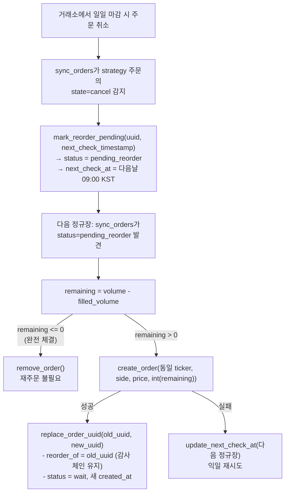

# kis_market_policy.md — KIS 정규장 정책 및 재주문 로직

## 왜 KIS는 특수 처리가 필요한가

KIS(한국투자증권)는 KRX 정규장 시간에만 주문을 처리하며, 지정가 주문은 당일 마감 시 소멸. 봇은 전략 주문을 매일 아침 재제출해야 함.

## 정규장 판별 함수

```python
def is_kis_regular_session(now=None) -> bool:
    # 평일(월=0 ~ 금=4)만 유효
    # 정규장: 09:00:00 – 15:35:00 KST (양 끝 포함)
    now = _as_kst_now(now)
    if now.weekday() >= 5:
        return False
    return dt_time(9, 0) <= now.time() <= dt_time(15, 35)
```

`_as_kst_now(now)` — KST aware datetime 반환; naive datetime은 이미 KST로 가정 (테스트용).

## 다음 정규장 계산

```python
def next_kis_regular_session(now=None) -> datetime:
    # 오늘 평일이고 09:00 이전 → 오늘 09:00
    # 그 외 → 다음 평일 09:00
    # 토·일 건너뜀
```

`kis_next_check_timestamp()` — 위를 wrapping, Unix float 반환.

## 장외 시간 주문 처리 흐름

`sync_orders` 가 KIS 주문을 만나고 `exchange_adapter.get_exchange(exchange).is_market_open()` 이 False일 때(`KisExchange.is_market_open()`이 내부적으로 `is_kis_regular_session()`을 호출):
1. `update_next_check_at(uuid, kis_next_check_timestamp())` 설정
2. sync 루프는 `next_check_at` 이전까지 해당 주문 건너뜀

## 신규 주문 발행 시점에 장외인 경우 — reserved 배치

위 흐름은 **이미 거래소에 제출된 주문**이 장외로 들어가는 경우다. 반면 `/grid`, `/rsitrade`, `/sgridrsi`, `/buy`, `/sell` 자체가 장외 시간에 실행되면, KIS/Toss는 장외에 신규 주문 제출이 안 되므로 호출부(`src/core/order_execution.py`, `src/handlers/manual_order_handlers.py`)가 실거래소 API를 호출하지 않고 가짜 uuid(`reserved:<hex>`)로 `order_manager.add_order(..., status="reserved")`만 등록한다:

```python
is_reserved = getattr(ex, "supports_reserved_orders", False) and not ex.is_market_open(ticker)
```

이 분기가 빠지면(과거 `execute_rsitrade_orders`/`execute_sgridrsi_orders`/수동 주문 버그) 장외 호출이 실거래소 API에 그대로 들어가 실패하고, 등록조차 안 되어 주문이 추적/manager UI에서 통째로 사라진다 — 반드시 grid와 동일한 분기를 유지할 것.

`reserved` 주문은 다음 정규장에 `sync_orders`(`src/main.py:307`)가 `pending_reorder`와 동일 경로로 실제 `create_order()`를 제출하고 `replace_order_uuid`로 진짜 uuid로 교체한다. 상세 상태 기계는 `docs/impl/order_manager.md` 참조.

`supports_reserved_orders=True`는 `RegularSessionMixin`(`src/core/exchanges/regular_session.py`)을 상속하는 거래소(KIS/Toss) 공통 capability이며, 이 문서 제목은 KIS 기준이지만 Toss도 동일하게 적용된다.

## 전략 주문 재주문 흐름



## 수동 주문 vs 전략 주문

| 구분 | 재주문 여부 | 취소/만료 시 동작 |
|------|------------|------------------|
| `strategy="manual"` | X | 추적 제거 + 알림 |
| `strategy="grid"/"sgrid"/"rsitrade"` | O | `pending_reorder` 전환 |

## 부분 체결 처리

`filled_volume` 은 `replace_order_uuid` 시 보존됨. 재주문 수량은 항상 `volume - filled_volume` 잔량. KIS는 정수 단위이므로 `int(remaining)` 사용, 0이면 재주문 생략.

## 테스트 커버리지

`tests/test_config_and_market_policy.py` 의 `test_kis_market_time_gate`:
- 정규장 내부 → `True`
- 마감 후(16:00) → `False`
- 토요일 → `False`
- `next_kis_regular_session(마감후)` → 다음 월요일 09:00
