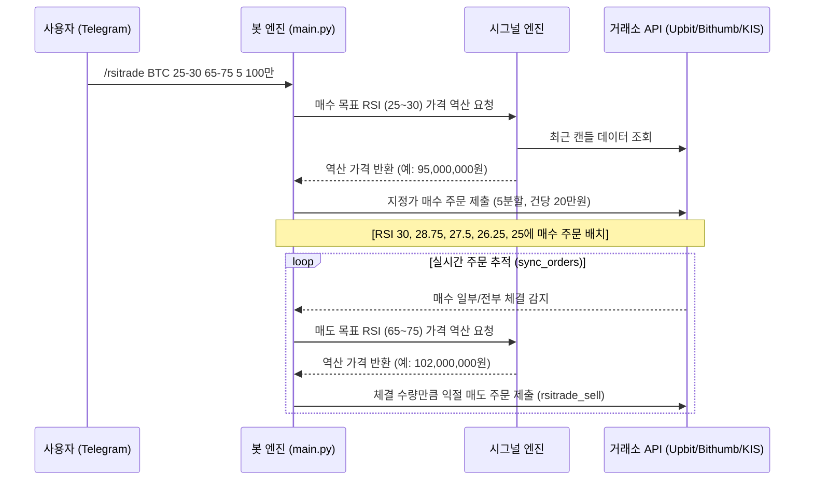

# rsi_algorithm.md — RSI 역산 수식 및 자동매매 전략 상세 명세

본 문서는 수파봇(supabot)에 구현된 핵심 트레이딩 전략(RSI 순환 매매, 거미줄 매수/매도)의 수학적 원리, 탐색 알고리즘, 라이프사이클 및 예외 처리 메커니즘을 상세히 기술합니다.

---

## 1. RSI 가격 역산 알고리즘

### 표준 RSI 공식 (순방향)
RSI(상대강도지수)는 일정 기간(보통 14캔들) 동안의 가격 상승폭과 하락폭의 상대적인 강도를 백분율로 나타냅니다.
$$RSI = 100 - \frac{100}{1 + RS}$$
$$RS = \frac{\text{AvgGain (평균 상승폭)}}{\text{AvgLoss (평균 하락폭)}}$$

봇 내부에서는 순방향 RSI 계산 시 파이썬 `ta` 라이브러리의 `ta.momentum.RSIIndicator`를 활용합니다.

### 역산(Reverse Calculation) 방식
일반적인 지표 매매는 "현재 RSI가 N 이하일 때 매수"하는 방식으로 동작하지만, 이는 급등락 시 가격이 밀려 체결되지 않거나 원치 않는 가격에 진입하는 문제가 있습니다.
수파봇은 **"목표 RSI(예: 30)를 만족하게 만드는 가격은 얼마인가?"**를 역산하여 해당 가격에 미리 **지정가 주문**을 배치합니다.

1. **가상 캔들 대입 기법**
   - 닫힌 형식(Closed-form)의 수학 공식 대신, 과거 종가 배열(캔들 `period + 50`개)의 끝에 `가상의 다음 종가(next_close)`를 추가합니다.
   - `close_series + [next_close]` 데이터셋에 대해 `RSIIndicator`를 다시 실행합니다.
   
2. **이분 탐색 (Binary Search)을 통한 가격 추적**
   - **매수(Bid)**: 가상의 가격을 현재가 아래에서 낮춰가며 목표 RSI 이하가 되는 경계 가격을 탐색합니다.
   - **매도(Ask)**: 가상의 가격을 현재가 위로 높여가며 목표 RSI 이상이 되는 경계 가격을 탐색합니다.
   - 이 방식은 봇이 조회하는 RSI 화면 표시값과 미리보기 주문 가격이 완전히 일치하도록 보장합니다.

3. **수수료 및 슬리피지 버퍼 (0.1%)**
   RSI 트리거 도달 즉시 확실하게 체결되도록 하기 위해 역산된 목표가에 버퍼를 적용합니다.
   - **매수 가격**: $\text{target\_price} \times 0.999$ (RSI 트리거가보다 0.1% 낮게 매수 예약)
   - **매도 가격**: $\text{target\_price} \times 1.001$ (RSI 트리거가보다 0.1% 높게 매도 예약)
   
4. **호가 틱(Tick) 보정**
   최종 가격은 각 거래소별/가격대별 호가 단위(Tick Size)에 맞추어 내림(floor) 처리하여 유효한 주문 가격으로 변환합니다.

---

## 2. RSI 순환 매매 전략 (`/rsitrade`)

과매도 구간에서 매집하여 과매수 구간에서 분할 익절하는 순환 매매 전략의 전체 흐름입니다.

### 핵심 상세 로직

1. **분할 매수 진입**
   - 사용자가 지정한 매수 RSI 구간(예: `25-30`)과 분할 횟수(예: `5`)에 따라 등간격으로 목표 RSI를 쪼갭니다 (예: 30, 28.75, 27.5, 26.25, 25).
   - 각 RSI 단계에 맞춰 가격을 역산하고, 총 예산을 분할 횟수로 나눈 금액만큼 매수 주문을 다수 제출합니다.

2. **체결 대응 및 익절 매도 (`rsitrade_sell`)**
   - 백그라운드 폴링 스레드(`sync_orders`)가 주문 체결 상태를 지속적으로 확인합니다.
   - 매수 주문이 부분 또는 전량 체결될 때마다, **방금 체결된 수량만큼 즉시 연동된 익절 매도 주문을 생성**합니다.
   - 매도 가격은 사용자가 설정한 매도 RSI 구간(예: `65-75`)의 하한선(여기서는 RSI 65)에 매칭하여 실시간으로 가격을 역산해 지정가로 제출합니다.

3. **손절(Stop-Loss) 및 트레이링 스톱(Trailing Stop)**
   - **손절가 계산**: 매수 체결 후 매도 대기 상태(`rsitrade_sell`)에 들어갈 때, 사용자 설정에 `stop_loss_pct`가 존재하면 매수가 기준 손절가를 계산해 데이터베이스에 함께 기록합니다.
     $$\text{stop\_price} = \text{buy\_price} \times \left(1 - \frac{\text{stop\_loss\_pct}}{100}\right)$$
   - **손절 실행**: 현재가가 `stop_price` 미만으로 추락하면, 활성화된 익절 매도 주문을 즉시 취소하고 시장가에 준하는 가격(현재가 $\times 0.999$)으로 긴급 손절 주문을 내어 리스크를 제한합니다.
   - **트레이링 스톱**: `trailing_stop_pct`가 설정되어 있으면 현재가가 최고점을 갱신하며 상승할 때마다 `stop_price`도 상향 조정하여 이익을 보존합니다.

---

## 3. 거미줄 분할 매매 전략 (`/grid`, `/sgrid`)

지정된 가격 범위 내에 거미줄망처럼 분할 주문을 깔아두는 정통 그리드 매매입니다.

### 거미줄 매수 (`/grid`)
- **개념**: 물량 매집을 위해 지정한 가격 밴드(`시작가` ~ `종료가`)에 동일 예산을 쪼개어 균등한 간격으로 매수 주문을 배치합니다.
- **주문당 수량 계산**: 
  $$\text{volume} = \frac{\text{총 예산} / \text{주문 개수}}{\text{해당 그리드 가격}}$$
- **제약 사항**:
  - 한국투자증권(KIS)의 경우, 수량이 소수점 이하일 수 없으므로 `int(volume)`로 소수점을 내림합니다. 이에 따라 주문당 수량이 `0주`가 되는 소액 예산 주문은 사전에 검증하여 실행을 차단합니다.

### 거미줄 매도 (`/sgrid`)
- **개념**: 보유하고 있는 자산을 분할 익절하거나 탈출하기 위해 특정 가격 범위에 수량을 쪼개어 매도 주문을 배치합니다.
- **주문당 수량 계산**: 
  $$\text{volume} = \frac{\text{보유 총 수량}}{\text{주문 개수}}$$
- **제약 사항**:
  - 마찬가지로 KIS에서는 총 수량이 주문 개수보다 적어 1주 미만으로 쪼개질 경우, 즉시 주문 제출 단계에서 경고와 함께 취소됩니다.

---

## 4. 거래소별 전략 처리 특이사항

### 한국투자증권 (KIS) 국내주식
1. **정규장 거래 제한**:
   - 주식 시장은 평일 09:00 - 15:35에만 정규장이 열리며, 장외 시간엔 거래소에 신규 주문을 제출할 수 없습니다.
   - 봇은 장외 또는 주말에 `/grid` / `/sgrid` (및 `/rsitrade`, `/sgridrsi`, `/buy`, `/sell`) 실행 요청 시 주문을 반려하지 않고 `reserved` 상태로 등록해두며, 다음 정규장 시작(09:00)에 자동으로 실제 주문을 제출합니다(상태 기계: `docs/impl/order_manager.md`).
2. **주문 만료 및 재주문 복구 (`pending_reorder`)**:
   - 주식 시장의 지정가 주문은 정규장 마감(15:35) 이후 당일 만료되어 자동 취소됩니다.
   - 코인과 달리 전략이 하루 만에 끝나지 않으므로, 봇은 취소된 KIS 주문을 감지하면 즉시 데이터를 삭제하지 않고 `pending_reorder` 상태로 이월합니다.
   - 다음 영업일 정규장 시작(09:00) 시, 봇은 **"원래 설정된 목표 수량 - 이미 체결 완료된 수량"** 만큼의 잔량에 대해 자동으로 동일 조건으로 재주문을 제출합니다.
   - 재주문이 완료되면 새로운 거래소 주문 ID(UUID)를 발급받아 감사 체인(`reorder_of`)을 연결하고 지속 추적합니다.

### 코인 거래소 (Upbit / Bithumb)
- 24시간 연중무휴 거래되므로 장외 제한이나 만료로 인한 자동 재주문 프로세스는 타지 않으며, 한 번 세팅된 주문은 체결되거나 사용자가 직접 취소할 때까지 영구히 추적됩니다.
